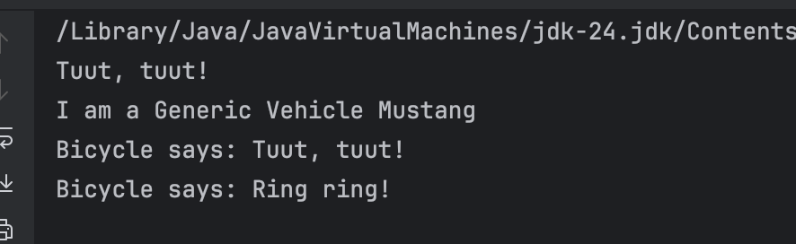
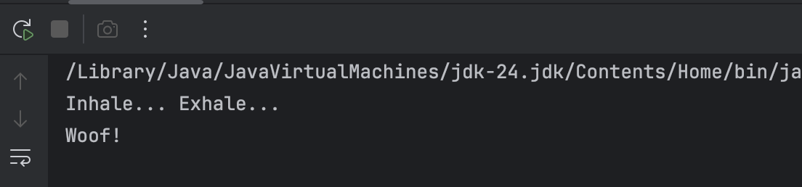
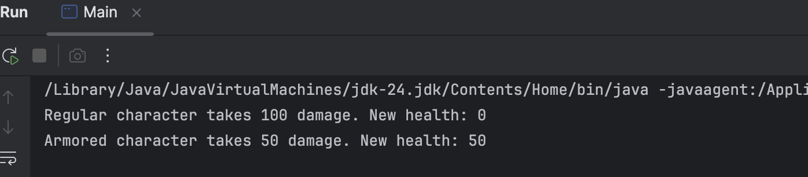
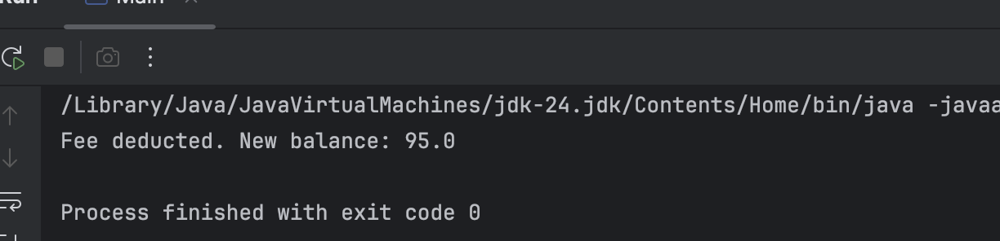

# Harold Bryan Santos

### Outputs:
***
## 1. Basic Inheritance: The extends Keyword

*   A)
```declarative
Tuut, tuut!
I am a Generic Vehicle Mustang
```
### Mini Challenge


## 2. Abstract Classes: Defining a Template

*   B)
```declarative
The area is: 78.53981633974483
The area is: 24.0
```
### Mini Challenge


## 3. Method Overriding: Providing a New Implementation

*   B)
```declarative
--- Regular Editor ---
Opening a generic file.

--- Code Editor ---
Applying syntax highlighting...
Opening a generic file.

--- Polymorphic Editor ---
Applying syntax highlighting...
Opening a generic file.
```
### Mini Challenge


## 4. Inheriting Variables & Access Rules

### Mini Challenge
